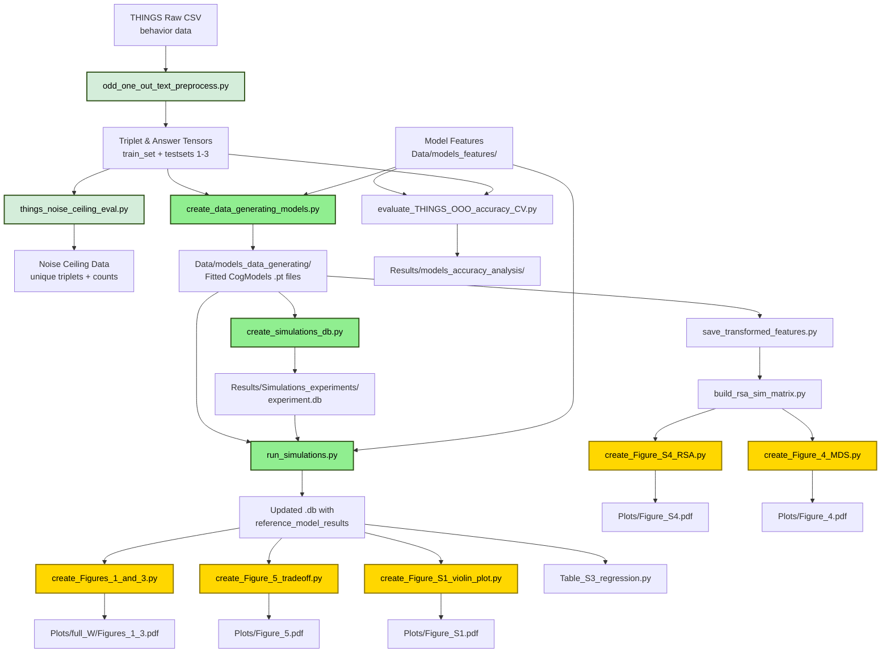
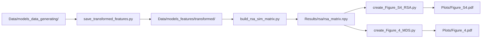

# Pipeline and Dependency Map

This document provides a comprehensive map of the analysis pipeline, showing how scripts depend on each other and what data flows between them.

## Overview

The project implements a four-stage model recovery pipeline:
0. **Data Preprocessing**: Convert raw THINGS behavioral data to tensor format and compute noise ceiling
1. **Data Preparation**: Fit neural network features to THINGS behavioral data
2. **Simulation Database Creation**: Generate all job specifications
3. **Simulation Execution**: Run model recovery experiments in parallel
4. **Analysis & Visualization**: Generate figures and statistical analyses

---

## Main Pipeline Flow



---

## Detailed Stage Breakdown

### Stage 0: THINGS Data Preprocessing (Required First Step)

#### Step 0A: Convert CSV to Tensors

**Script**: `analysis_scripts/odd_one_out_text_preprocess.py`

**Purpose**: Convert raw THINGS behavioral data from CSV format to PyTorch tensors for efficient loading. This is the **first preprocessing step** required before any model training or evaluation.

**Inputs**:
- `Data/Things_data/behavior_data/triplets_large_final_correctednc_correctedorder.csv`
  - Columns: image1, image2, image3, choice, subject_id, noise_ceiling
  - ~4.7M human odd-one-out judgments total
  - noise_ceiling column: 0=train, 1/2/3=test sets for noise ceiling estimation
  - Download from: https://osf.io/f5rn6/ (data/triplet_dataset/)
  - THINGS images: https://osf.io/jum2f/

**Process**:
1. Read CSV with 1-based indexing (images 1-1854)
2. Convert to 0-based indexing (images 0-1853) for PyTorch
3. Split data based on noise_ceiling column:
   - noise_ceiling=0: Training set (~4.2M judgments)
   - noise_ceiling=1/2/3: Test sets for noise ceiling (~250K judgments each)
4. Create three tensors per dataset:
   - Triplets: [N×3] which images form each triplet
   - Answer positions: [N] chosen position (0, 1, or 2)
   - Answer image indices: [N] chosen image ID
5. Save summary statistics (n_triplets, n_unique_triplets, n_unique_images)

**Outputs**:
- `Data/Things_data_preprocessed/Things_odd_one_out_triplets_{dataset}.pt`
- `Data/Things_data_preprocessed/Things_odd_one_out_answers_positions_{dataset}.pt`
- `Data/Things_data_preprocessed/Things_odd_one_out_answers_image_index_{dataset}.pt`
- `Data/Things_data_preprocessed/things_datasets_info.csv` (summary statistics)

**Configuration**: `scripts_configurations/odd_one_out_preprocess.yaml`

**Must run before**: All other pipeline scripts (creates required tensor files)

---

#### Step 0B: Compute Noise Ceiling

**Script**: `analysis_scripts/things_noise_ceiling_eval.py`

**Purpose**: Calculate human noise ceiling using leave-one-out cross-validation. The noise ceiling quantifies human inter-rater agreement and sets the performance upper bound for computational models.

**Inputs**:
- Preprocessed triplet tensors from Step 0A (testsets 1-3)
- Answer position tensors from Step 0A
- Original CSV for participant counting

**Process**:
1. Load test set tensors (1-3) with multiple participants per triplet
2. Normalize triplet orderings by sorting concept indices:
   - [1,2,3], [3,2,1], [2,1,3] all map to [1,2,3]
   - Update answer positions to match sorted order
3. Aggregate response counts per unique triplet: [c0, c1, c2]
4. Compute leave-one-out noise ceiling:
   - For each triplet, remove one response at a time
   - Predict that response from majority of remaining responses
   - Average agreement across all leave-one-out trials
5. Calculate statistics per test set and combined

**Outputs**:
- `Data/Things_data_preprocessed/unique_triplets_and_counts/`
  - `test_X_unique_triplets.pt`: Unique normalized triplets
  - `test_X_answers_counts.pt`: Response count vectors [c0, c1, c2]
  - `all_tests_unique_triplets.pt`: Combined across test sets
  - `all_tests_answers_counts.pt`: Combined response counts
  - `analysis_noise_ceiling.csv`: Summary with noise ceiling values


**Note**: Test set 2 is the primary validation benchmark. All model performance comparisons, noise ceiling references in figures/tables, and reported results in the paper are based on test set 2 values.

**Configuration**: `scripts_configurations/things_noise_ceiling_eval.yaml`

**Used by**: 
- Model evaluation scripts (to compare model performance against human ceiling)
- Temperature fitting (to match human noise level)
- Figure generation (to show model performance relative to human agreement)

---

### Stage 1: Data-Generating Models Creation

**Script**: `experiment_scripts/create_data_generating_models.py`

**Purpose**: Fit neural network features to THINGS behavioral data to create "ground truth" models that will generate synthetic data.

**Inputs**:
- `Data/Things_data_preprocessed/triplets.pt` - Human odd-one-out triplets
- `Data/Things_data_preprocessed/human_choices.pt` - Human responses
- `Data/models_features/full/<model>.pt` - Pre-extracted model features (1854 concepts × feature_dim)

**Process**:
1. Load model features for specified models
2. Create CogModel with specified constraints (full_W, diagonal, etc.)
3. Fit W transformation matrix using LBFGS optimizer
4. Fit temperature parameter to match human noise ceiling
5. Save fitted model to disk

**Outputs**:
- `Data/models_data_generating/<regularization>/<constraint_type>/<model>.pt`
  - Examples: `Data/models_data_generating/full_W/ResNet50.pt`
  - Each .pt file contains a saved PyTorch CogModel module (nn.Module)

**Transformation Flexibility Levels**:
- `full_W`: Unconstrained linear transformation (maximum flexibility)
- `diagonal`: Element-wise scaling only (diagonal matrix)
- `rectangular_k`: Low-rank projection to k dimensions
- `zero_shot`: Identity matrix (no learned transformation)
- `orthogonal`: Orthogonal transformation with scaling

**Regularization Types**:
- `L1`: Sparse weights penalty
- `L2`: Weight magnitude penalty
- `eye_distance`: Shrinkage toward identity matrix

**Dimensionality Reduction** (optional):
- Can apply PCA to reduce feature dimensions (e.g., `PCA_500` for 500-dim features)
- Reduces computational cost while preserving variance

**Configuration**: `scripts_configurations/create_data_generating_models.yaml`

---

### Stage 2: Simulation Database Creation

**Script**: `experiment_scripts/create_simulations_db.py`

**Purpose**: Create SQLite database with all simulation job specifications (but don't run them yet).

**Inputs**:
- Configuration specifying:
  - `n_train_triplets_list`: [100, 200, 500, ..., 100000]
  - `simulations_idx_list`: [0, 1, 2, ..., 9] (10 simulations per condition)
  - `data_generating_models_list`: List of model names
  - Constraint type, regularization method, etc.

**Process**:
1. Initialize SQLite database with schema (jobs and reference_model_results tables)
2. Generate all job combinations via `itertools.product()`
3. Insert jobs with status='pending'

**Outputs**:
- `Results/Simulations_experiments/<experiment>/<experiment>.db`
  - Contains jobs table with all pending simulation specifications
  - Example: 8 triplet counts × 10 simulations × 20 models = 1,600 jobs

**Configuration**: `scripts_configurations/create_simulations_db.yaml`


---

### Stage 3: Simulation Execution (Parallelizable)

**Script**: `experiment_scripts/run_simulations.py`

**Purpose**: Execute model recovery experiments by fetching pending jobs from database, running them, and saving results.

**Inputs**:
- `Results/Simulations_experiments/<experiment>/<experiment>.db` (from Stage 2)
- `Data/models_data_generating/<constraint>/<model>.pt` (from Stage 1)
- `Data/models_features/full/<model>.pt` (model features for reference models)

**Process (for each job)**:
1. **Fetch job atomically** from database (BEGIN EXCLUSIVE lock)
2. **Load data-generating model** from saved .pt file (PyTorch module)
3. **Generate synthetic triplets** from disjoint concept subsets (K-fold CV)
4. **Simulate human responses** using data-generating model's similarity function
5. **For each reference model**:
   - Load reference model features (can be PCA-reduced or full-dimensional)
   - For each regularization constant:
     - Fit W matrix on training fold
     - Evaluate on validation fold
   - Select best regularization constant
   - Retrain on train+val, test on held-out fold
   - Store: test_acc, train_acc, val_acc, NLL, chosen_reg_constant
6. **Save results** to database (reference_model_results table)
7. **Mark job complete** (status='done')

**Outputs**:
- Updates database with reference_model_results entries
- Each job generates ~20-30 result rows (one per reference model tested)

**Configuration**: `scripts_configurations/run_simulations.yaml`

**Parallelization**:
- Can run multiple workers simultaneously (on one machine or cluster)
- Atomic job fetching prevents duplicate work
- Workers automatically stop when no pending jobs remain

---

### Stage 4A: Main Figure Generation

#### Figures 1 & 3: Model Recovery Analysis

**Script**: `figures_scripts/create_Figures_1_and_3.py`

**Inputs**:
- `Results/Simulations_experiments/full_W/full_W.db`

**Outputs**:
- `Plots/full_W/Figure_1.pdf` - Recovery curves + confusion matrices
- `Plots/full_W/Figure_3.pdf` - Ranking analysis

**What it shows**:
- Panel A: Recovery accuracy vs. training triplets (line plot)
- Panels B-D: Confusion matrices at 400, 25.6K, 1.6M triplets
- Figure 3: Mean rank when correct vs. incorrect

**Dependencies**: `tools/db_analysis.py` (DBResultsAnalysis, ModelRecoveryVisualizer)

---

#### Figure 5: Flexibility-Accuracy Tradeoff

**Script**: `figures_scripts/create_Figure_5_tradeoff.py`

**Inputs**:
- `Results/Simulations_experiments/full_W/full_W.db`
- `Results/Simulations_experiments/zero_shot/zero_shot.db`
- `Results/Simulations_experiments/diagonal/diagonal.db`
- `Results/models_accuracy_analysis_THINGS_accuracy/` (from evaluation script)

**Outputs**:
- `Plots/Figure_5.pdf` - Tradeoff between recovery accuracy and THINGS prediction accuracy

**What it shows**:
- X-axis: THINGS odd-one-out prediction accuracy (how well model fits human data)
- Y-axis: Model recovery accuracy (how well we can identify the model)
- Different constraint types plotted as different series

---

### Stage 4B: Supplementary Analyses

#### RSA & MDS Analysis

**Pipeline**:


**Purpose**: Analyze representational geometry shifts after W transformation

1. **save_transformed_features.py**: Apply W transformation to all model features
2. **build_rsa_sim_matrix.py**: Compute RSA similarity matrix between all models
3. **create_Figure_S4_RSA.py**: Visualize RSA matrix as heatmap
4. **create_Figure_4_MDS.py**: Project RSA distances into 2D using MDS

---

#### Statistical Regression Analysis

**Script**: `analysis_scripts/Table_S3_regression.py`

**Inputs**:
- `Results/Simulations_experiments/full_W/full_W.db`
- `Results/models_n_params_table/` (model properties)
- `Results/effective_dimensionality_score/` (pre-computed dimensionality)

**Outputs**:
- `Results/regression_analysis/regression_table.csv`
- LaTeX table for supplementary material

**What it does**: Bootstrap regression to identify predictors of recovery accuracy (model parameters, layers, effective dimensionality)

---

#### THINGS Evaluation (Essential for Figure 2)

**Script**: `analysis_scripts/evaluate_THINGS_OOO_accuracy_CV.py`

**Purpose**: Evaluate models on real THINGS data to measure prediction accuracy. **Required for Figure 2** which shows the tradeoff between model recovery accuracy and THINGS prediction accuracy.

**Inputs**:
- `Data/Things_data_preprocessed/triplets.pt`
- `Data/Things_data_preprocessed/human_choices.pt`
- `Data/models_features/full/<model>.pt` (or PCA-reduced features)

**Outputs**:
- `Results/regularization_methods_compare_all_models_<reg_type>/<feature_type>/<constraint>/`
  - Example: `Results/regularization_methods_compare_all_models_eye_distance/full/full_W/`
  - **Important**: Default config evaluates BOTH L2 AND eye_distance regularizations
  - Results for each regularization saved in separate CSV files in the SAME directory:
    - `best_test_acc_L2_full_full_W.csv` (L2 results)
    - `best_test_acc_eye_distance_full_full_W.csv` (eye_distance results)
    - `best_test_acc_for_each_model_full_full_W.csv` (combined comparison)
- Cross-validated prediction accuracy on THINGS dataset
- **Must be run for all flexibility levels shown in Figure 2** (full_W, diagonal, zero_shot, etc.)

**Directory Naming Convention**:
- **Multiple regularizations** (default): Directory name uses primary/default regularization as suffix
  - Example: `_eye_distance` when evaluating both L2 and eye_distance
- **Single regularization**: Directory name uses that specific regularization
  - Example: `_L2` when evaluating L2 only

**Figure Scripts**: Use the same directory path and select which regularization via `regularization_type` parameter

**Configuration**: `scripts_configurations/evaluate_THINGS_OOO_accuracy_CV.yaml`

**Usage**: Generates data for Figure 5 X-axis (THINGS prediction accuracy) and Figure 2 comparisons across flexibility levels

---

## Configuration Hierarchy

All scripts use Hydra for configuration management:

```
scripts_configurations/
├── shared_args.yaml          # Base config: model lists, paths, defaults
├── create_data_generating_models.yaml
├── create_simulations_db.yaml
├── run_simulations.yaml
├── figures_1_and_3.yaml
├── Figure_5.yaml
├── RSA_MDS_figures.yaml
└── evaluate_THINGS_OOO_accuracy_CV.yaml
```

**Inheritance pattern**:
- Most configs import `shared_args.yaml` via `defaults:`
- Experiment-specific parameters override shared defaults
- Command-line arguments override everything

**Example**:
```bash
python run_simulations.py experiment_type=full_W  # Uses experiment_type section from config
python create_Figures_1_and_3.py experiment_name=full_W_PCA_500  # Override experiment
```

---

## Data Dependencies Summary

### Required User-Provided Data

**Option 1: Full Rerun from Model Features**
- `Data/models_features/full/<model>.pt` - Neural network features for 1854 THINGS concepts
- `Data/Things_data_preprocessed/triplets.pt` - Human odd-one-out triplets
- `Data/Things_data_preprocessed/human_choices.pt` - Human responses

**Option 2: Reanalysis from Pre-computed Results**
- `Results/Simulations_experiments/<experiment>/<experiment>.db` - Simulation results database
- `Data/models_data_generating/<constraint>/<model>.pt` - Fitted data-generating models (saved PyTorch modules)

### Generated/Intermediate Data

**Stage 1 Outputs**:
- `Data/models_data_generating/` - Fitted CogModel instances

**Stage 2 Outputs**:
- `Results/Simulations_experiments/` - Simulation databases

**Stage 3 Outputs**:
- Updated databases with `reference_model_results`

**Analysis Outputs**:
- `Results/rsa/` - RSA similarity matrices
- `Results/models_accuracy_analysis_THINGS_accuracy/` - THINGS evaluation results
- `Results/regression_analysis/` - Statistical analysis tables

**Final Outputs**:
- `Plots/` - Publication-ready PDF figures

---

## Parallel Execution Patterns

### Database-Driven Parallelization

The pipeline supports parallel execution via atomic job fetching:

```python
# In run_simulations.py
while True:
    job = get_pending_job(db_path)  # Atomic via BEGIN EXCLUSIVE
    if job is None:
        break  # No more pending jobs
    
    # Process job...
    save_results(db_path, job_id, results)
    mark_job_done(db_path, job_id)
```

**Benefits**:
- No coordination needed between workers
- Works across cluster nodes (shared filesystem)
- Automatic load balancing (workers fetch next available job)
- Fault tolerant (stuck jobs can be reset)

**Example Deployment**:
```bash
# Single machine with 4 workers
python run_simulations.py experiment_type=full_W &
python run_simulations.py experiment_type=full_W &
python run_simulations.py experiment_type=full_W &
python run_simulations.py experiment_type=full_W &

# Cluster with SLURM
sbatch run_simulations.sh  # Submit 10 array jobs
```

---

## Common Workflow Scenarios

### Scenario 1: Generate All Figures from Pre-computed Results

```bash
# Download pre-computed results and data from Figshare:
# https://figshare.com/articles/dataset/Data_and_analysis_results_/30542690


python figures_scripts/create_Figures_1_and_3.py experiment_name="full_W"
python figures_scripts/create_Figure_5_tradeoff.py
python figures_scripts/create_Figure_S1_violin_plot.py
python figures_scripts/create_Figure_S4_RSA.py
python figures_scripts/create_Figure_4_MDS.py
python analysis_scripts/Table_S3_regression.py
```

### Scenario 2: Full Pipeline from Model Features

```bash
# 1. Fit data-generating models
python experiment_scripts/create_data_generating_models.py experiment_type=full_W

# 2. Create simulation database
python experiment_scripts/create_simulations_db.py experiment_type=full_W

# 3. Run simulations (can parallelize this step)
python experiment_scripts/run_simulations.py experiment_type=full_W

# 4. Evaluate on THINGS data (REQUIRED for Figure 2)
python analysis_scripts/evaluate_THINGS_OOO_accuracy_CV.py \
    constraint_type=full_W

# 5. Generate all figures
python figures_scripts/create_Figures_1_and_3.py experiment_name="full_W"
python figures_scripts/create_Figure_2.py
python figures_scripts/create_Figure_5_tradeoff.py
# ... etc.
```

### Scenario 3: Add New Model to Existing Experiment

```bash
# 1. Extract features for new model (outside this codebase)
# Save to: Data/models_features/full/NewModel.pt
# (Optionally create PCA-reduced version: Data/models_features/PCA_500/NewModel_PCA_500.pt)

# 2. Add model to config (edit scripts_configurations/shared_args.yaml)
# new_models: [..., "NewModel"]

# 3. Create data-generating version (choose flexibility level and regularization)
python experiment_scripts/create_data_generating_models.py \
    experiment_type=full_W \
    models_to_fit='["NewModel"]' \
    reg_func=eye_distance

# 4. Add jobs to database
python experiment_scripts/create_simulations_db.py experiment_type=full_W_new_model

# 5. Run simulations for new model
python experiment_scripts/run_simulations.py experiment_type=full_W_new_model

# 6. Evaluate on THINGS (if needed for Figure 2)
python analysis_scripts/evaluate_THINGS_OOO_accuracy_CV.py \
    models_list='["NewModel"]' \
    constraint_type=full_W

# 7. Regenerate figures (now includes new model)
python figures_scripts/create_Figures_1_and_3.py experiment_name="full_W_new_model"
```

---

## File Dependency Checker

To verify all dependencies are in place before running a script:

```bash
# Check for Stage 1 (create_data_generating_models.py)
ls Data/Things_data_preprocessed/triplets.pt
ls Data/Things_data_preprocessed/human_choices.pt
ls Data/models_features/full/ResNet50.pt
# Or PCA-reduced: ls Data/models_features/PCA_500/ResNet50_PCA_500.pt

# Check for Stage 3 (run_simulations.py)
ls Results/Simulations_experiments/full_W/full_W.db
ls Data/models_data_generating/full_W/ResNet50.pt
ls Data/models_features/full/

# Check for Figure 2 (requires THINGS evaluation results)
ls Results/models_accuracy_analysis_THINGS_accuracy/full_W/
ls Results/models_accuracy_analysis_THINGS_accuracy/diagonal/
ls Results/models_accuracy_analysis_THINGS_accuracy/zero_shot/

# Check for Figure generation
ls Results/Simulations_experiments/full_W/full_W.db
sqlite3 Results/Simulations_experiments/full_W/full_W.db "SELECT COUNT(*) FROM jobs WHERE status='done';"
```

---
